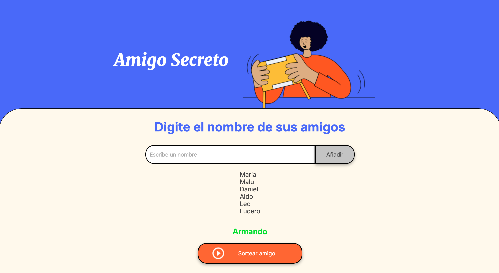

<h1 align="center">Challenge-Amigo-Secreto</h1>

<p align="center">
  
</p>

<p align="center">
  
  
  
</p>

---

## Descripción del Proyecto

**Amigo Secreto** es una aplicación interactiva que permite organizar sorteos de amigo secreto de manera sencilla. Los usuarios pueden ingresar nombres de amigos en una lista visible y realizar un sorteo aleatorio que selecciona a un "amigo secreto". Este proyecto es perfecto para reuniones familiares, eventos de trabajo o celebraciones con amigos.

---

## Estado del Proyecto

🚧 **Proyecto en desarrollo** 🚧

El proyecto está completamente funcional con las siguientes características implementadas:
- Agregar y visualizar nombres en una lista.
- Validar entradas vacías o nombres duplicados.
- Realizar un sorteo aleatorio.
- Eliminar automáticamente al "amigo secreto" sorteado para evitar repeticiones.

Futuras mejoras:
- Guardar los nombres ingresados en `localStorage` para persistencia.
- Añadir animaciones al sorteo.
- Personalización del diseño.

---

## Características

- **Agregar nombres:** 
  Los usuarios pueden ingresar nombres en un campo de texto y agregarlos a una lista visible al hacer clic en "Añadir".
- **Validación de entrada:** 
  - El sistema muestra una alerta si el campo está vacío.
  - Evita nombres duplicados en la lista.
- **Visualizar lista:** 
  Los nombres ingresados se muestran en tiempo real en una lista debajo del campo de entrada.
- **Sorteo aleatorio:** 
  Un botón permite realizar el sorteo, seleccionando un nombre al azar y mostrándolo en pantalla. El nombre sorteado se elimina de la lista para evitar repeticiones.

---

## Capturas de Pantalla

### Pantalla principal


### Sorteo en acción


---

## Acceso al Proyecto

### 🌐 Ver en línea:
Puedes acceder al proyecto en este [enlace](https://malu3010.github.io/Challenge-Amigo-Secreto/).

### 📂 Cómo descargar el proyecto:
1. Clona este repositorio:
   ```bash
   git clone https://github.com/tu-usuario/amigo-secreto.git](https://github.com/malu3010/Challenge-Amigo-Secreto.git
